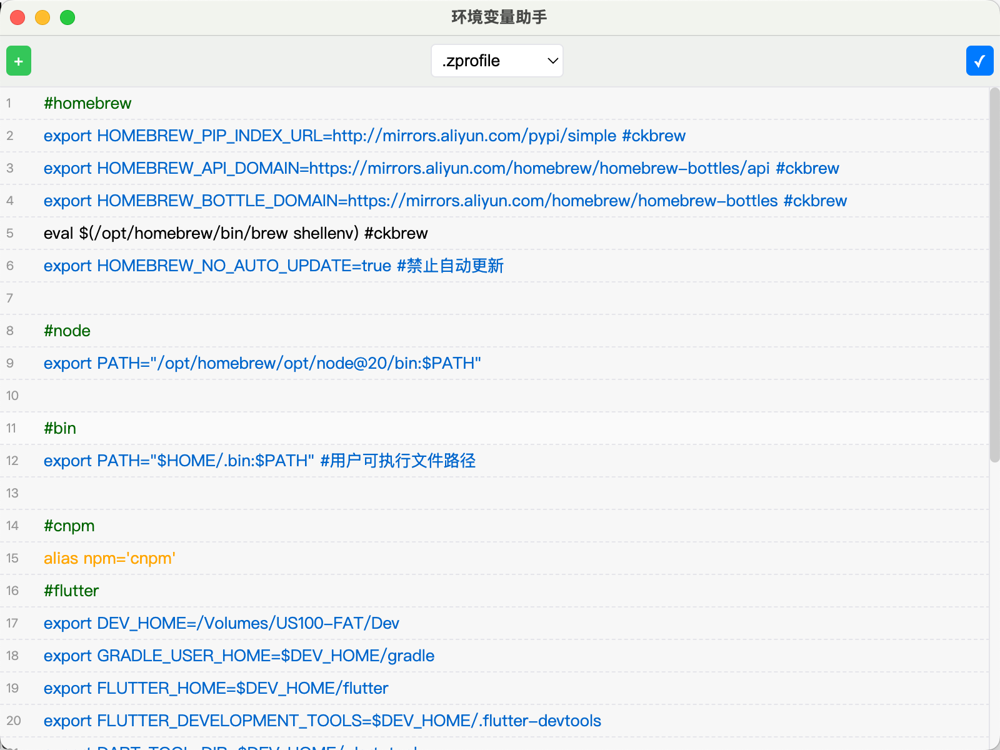

# hpath - 环境变量图形化设置工具

## 项目概述
hpath 是一款专为用户打造的环境变量图形化设置工具，它提供了直观的界面，帮助用户轻松管理和配置环境变量。通过该工具，用户可以方便地查看、编辑、添加和删除环境变量，而无需手动修改配置文件。

## 功能特性
- **多文件支持**：支持 `.zprofile`、`.zshrc`、`.bash_profile` 和 `.bashrc` 等常见的环境变量配置文件。
- **可视化编辑**：通过图形界面直观地对环境变量进行编辑，包括变量名、变量值和注释等。
- **实时预览**：在编辑过程中实时预览环境变量的修改效果。
- **数据保存**：支持保存所有修改，并将更改同步到相应的配置文件中。

## 安装与运行
### 前提条件
确保你已经安装了 Node.js 和 npm。

### 应用截图

